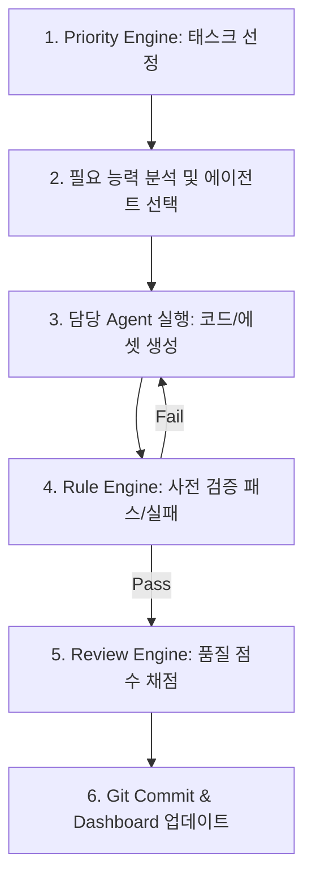

# AI Team Layer

The **AI Team Layer** defines the roles, responsibilities, capabilities, and collaborative structure of the AI agents working alongside humans in the Atlas ecosystem.

## 1. Agent Registry & Capability Matrix

| AI Agent | Role | Core Capabilities | Primary Responsibilities |
| :--- | :--- | :--- | :--- |
| **Marie (마리)** | System Architect | `Architecture`, `Review`, `Planning` | Handles overall workflow, technical design, and review gate standards. |
| **Antigravity (안티그래비티)** | Implementation Engine | `Python`, `C++`, `Automation` | Handles large-scale code generation, documentation, and scripting automation. |
| **Sera (세라)** | Design Director | `Concept`, `Character`, `UI`, `Audit`, `Governance` | Handles creative concepts, art style direction, world-building, and design compliance/governance. |
| **Forge (포지)** | Blender Expert | `Blender`, `Rig`, `Export` | Handles modeling, rigging, mesh optimization, and Blender pipeline tools. |
| **Builder (빌더 - Planned)** | Unreal Expert | `Unreal`, `Materials`, `Optim` | Handles Unreal Engine pipeline integration, material links, and asset optimization. |
| **Tester (테스터 - Planned)** | QA Agent | `QA`, `Testing`, `Diagnostics` | Handles test script execution, run-time diagnostics, and validation checks. |

---

## 2. Dynamic Agent Loop

The **Agent Loop** automates the entire development lifecycle, triggering agents dynamically based on capability requirements.

---

## 3. Human-AI Interaction & Delegation
* **Antigravity** executes, writes scripts, creates templates, and handles manual code generation tasks.
* **Marie** reviews designs for structural integrity, performance guidelines, and extensibility.
* **Human (Master)** makes final creative choices, decides priorities, and approves the architecture.

