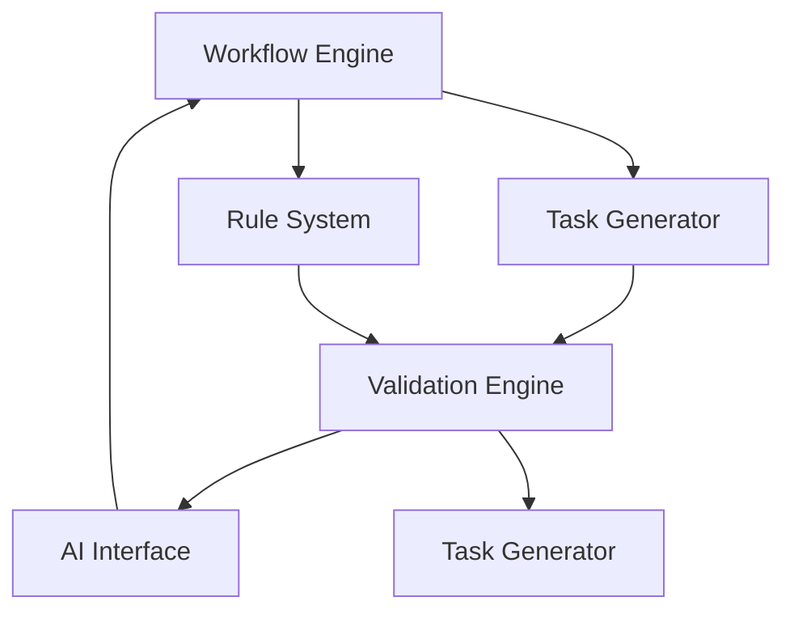

# Project Atlas System Architecture v2.0

## Core Modules

### 1. Workflow Engine
- **Purpose**: Task sequencing, state management, and workflow orchestration
- **Input**: Project goals, environment configuration, task registry
- **Output**: Task queue, workflow status, execution plan
- **Automation Potential**: 85% (Cline-driven workflow automation)
- **Integration**: 
  - `ATLAS_STATE.json` for environment awareness
  - `GOAL_REGISTRY.json` for goal alignment
  - `core/execution/priority_engine.py` for task prioritization

### 2. Validation Engine
- **Purpose**: Quality assurance through rule checks and AI review
- **Input**: Task output, design documents, environment config
- **Output**: Validation reports, optimization suggestions, compliance status
- **Automation Potential**: 75% (Rule-based auto-validation + AI review)
- **Integration**: 
  - `core/review/review_engine.py` for rule enforcement
  - Qwen API for AI-based quality checks
  - `environment_config.md` for environment-specific constraints

### 3. AI Interface
- **Purpose**: AI-powered review, coaching, and decision support
- **Input**: Task artifacts, design documents, validation reports
- **Output**: Review feedback, coaching suggestions, decision recommendations
- **Automation Potential**: 70% (Qwen-powered auto-review)
- **Integration**: 
  - Qwen API for AI review
  - `core/registry/goal_registry.py` for goal alignment
  - `core/decision/decision_engine.py` for AI-driven prioritization

### 4. Rule System
- **Purpose**: Maintain and enforce project-specific rules and checklists
- **Input**: Project charter, environment config, task definitions
- **Output**: Rule set, checklist templates, validation criteria
- **Automation Potential**: 60% (Auto-enforced rule checks)
- **Integration**: 
  - `core/rules/rule_engine.py` for rule execution
  - `core/config/project_lifecycle.json` for phase-specific rules
  - `core/registry/environment_config.md` for environment-specific rules

### 5. Task Generator
- **Purpose**: Auto-generate tasks based on project goals and environment
- **Input**: Project goals, environment config, workflow state
- **Output**: Task definitions, priority scores, execution plans
- **Automation Potential**: 80% (Cline-driven task generation)
- **Integration**: 
  - `core/execution/task_registry.py` for task storage
  - `core/decision/priority_engine.py` for environment-aware prioritization
  - `ATLAS_STATE.json` for active environment awareness

## Module Interaction Flow

## Data Flow

1. **Workflow Engine** receives project goals from `GOAL_REGISTRY.json`
2. **Task Generator** creates tasks based on environment config from `ATLAS_STATE.json`
3. Tasks are sent to **Validation Engine** for rule checks using `core/rules/rule_engine.py`
4. **AI Interface** provides review feedback via Qwen API
5. **Rule System** updates validation criteria from `core/config/project_lifecycle.json`
6. Final validated tasks are returned to **Workflow Engine** for execution

## Implementation Plan

### 1. MVP Implementation (Phase 1)
- Implement **Workflow Engine** with:
  - Task sequencing based on `GOAL_REGISTRY.json`
  - Environment-aware task prioritization using `ATLAS_STATE.json`
  - Basic rule checks from `core/config/project_lifecycle.json`

- Implement **Validation Engine** with:
  - Rule-based validation using `core/rules/rule_engine.py`
  - Simple AI review via Qwen API for critical tasks

- Implement **AI Interface** with:
  - Basic review capabilities for modeling tasks
  - Priority suggestion for task execution

### 2. Phase 2 Expansion
- Add **Rule System** with:
  - Full rule set from `core/config/project_lifecycle.json`
  - Environment-specific rules from `core/registry/environment_config.md`
  - Auto-generated checklists for common tasks

- Expand **AI Interface** with:
  - Full Qwen integration for all review tasks
  - Coaching suggestions for task execution
  - Real-time feedback during asset creation

### 3. Phase 3 Optimization
- Implement **Task Generator** with:
  - Full Cline integration for task generation
  - Environment-aware task creation
  - Auto-adjustment based on validation results

- Add **Blender/Unreal Integration**:
  - Auto-generate tasks for modeling/animation
  - Validate assets against rule sets
  - Provide AI feedback during asset creation

## Automation Opportunities

1. **Task Generation Automation**: 
   - Auto-create tasks based on project goals and environment
   - Use Cline for intelligent task sequencing

2. **Validation Automation**: 
   - Auto-validate assets against rule sets
   - Use Qwen for AI-based quality checks
   - Auto-generate validation reports

3. **AI Review Automation**: 
   - Auto-review modeling tasks with Qwen
   - Provide real-time feedback during asset creation
   - Auto-suggest improvements based on validation results

4. **Environment Awareness**: 
   - Auto-adjust task priorities based on `ATLAS_STATE.json`
   - Use environment-specific rules from `core/registry/environment_config.md`
   - Auto-disable tasks incompatible with current environment

5. **Rule Enforcement**: 
   - Auto-enforce rules from `core/config/project_lifecycle.json`
   - Auto-generate checklists for common tasks
   - Auto-validate against rule sets during task execution

## Tool Integration

- **Blender**: 
  - Use Python API for asset generation
  - Integrate with Validation Engine for rule checks
  - Use AI Interface for real-time feedback during modeling

- **Unreal Engine**: 
  - Use automation tools for asset import
  - Integrate with Validation Engine for rule checks
  - Use AI Interface for quality assurance

- **Cline**: 
  - Use for task generation and workflow orchestration
  - Integrate with AI Interface for decision support
  - Use for environment-aware task prioritization

- **Qwen**: 
  - Use for AI-based validation and review
  - Integrate with Validation Engine for quality checks
  - Provide real-time feedback during asset creation

## MVP Implementation Steps

1. **Setup Core Infrastructure**:
   - Create `core/execution/workflow_engine.py`
   - Implement basic task sequencing logic
   - Integrate with `GOAL_REGISTRY.json`

2. **Implement Validation Engine**:
   - Create `core/review/validation_engine.py`
   - Implement rule-based validation
   - Integrate with `core/rules/rule_engine.py`

3. **Setup AI Interface**:
   - Create `core/ai/ai_interface.py`
   - Implement basic Qwen integration
   - Add AI review capabilities for modeling tasks

4. **Implement Environment Awareness**:
   - Update `ATLAS_STATE.json` with environment config
   - Modify Workflow Engine to use environment-aware task prioritization
   - Integrate with `core/registry/environment_config.md`

5. **Add Rule System**:
   - Create `core/rules/rule_system.py`
   - Implement rule set from `core/config/project_lifecycle.json`
   - Add environment-specific rules from `core/registry/environment_config.md`

6. **Implement Task Generator**:
   - Create `core/execution/task_generator.py`
   - Implement Cline integration for task generation
   - Add environment-aware task creation logic

7. **Integrate with Tools**:
   - Connect Blender Python API with Validation Engine
   - Integrate Unreal Engine automation with Task Generator
   - Add Qwen integration for full AI review capabilities

This architecture provides a scalable foundation for Project Atlas, with clear module separation, environment awareness, and AI integration. The MVP implementation focuses on core functionality that can be expanded incrementally based on project needs.