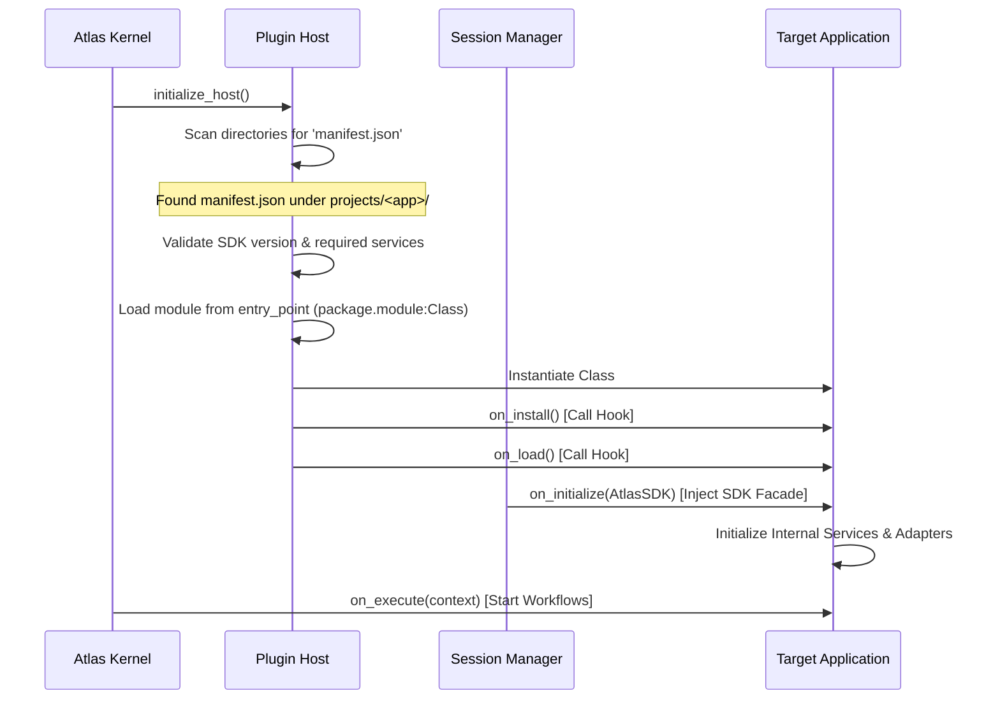

# Atlas 2.0 Application Discovery & Registration Specification

본 문서는 Atlas DevOS 커널이 외부 플러그인 응용 프로그램(Application/Plugin)을 자동으로 탐색(Discovery), 유효성 검증(Validation), 메모리 등록(Registration) 및 수명주기 격리를 수행하는 시스템 매커니즘을 정의합니다.

---

## 1. Application Discovery 개요

Atlas 2.0 커널은 기동 시 또는 동적 로드 명령 수신 시, 사전에 정의된 응용 프로그램 디렉터리(`projects/`, `apps/`)를 스캔하여 로드 가능한 애플리케이션을 자동으로 탐색합니다.

### 1.1 탐색 기준
* 지정된 하위 폴더 내에 **manifest.json** 파일이 존재해야 합니다.
* Manifest 파일 내에 `entry_point` 필드로 지정된 Python 모듈 및 클래스 경로가 유효해야 합니다.
* 참고: 과거 실험용 `projects/forge` 트리는 `archive/projects-forge-legacy/`로 이동됨 (운영 경로 아님).

---

## 2. Manifest Schema 규격

플러그인 루트에 배치할 `manifest.json`은 아래의 필드 규격을 준수해야 합니다.

```json
{
  "name": "ApplicationName",
  "description": "Short description of the app functionality",
  "version": "X.Y.Z",
  "required_sdk_version": "A.B",
  "entry_point": "package.module:ClassImplementingIApplication",
  "required_services": [
    "ai", "event", "memory"
  ],
  "supported_adapters": [
    "blender", "unreal"
  ]
}
```

* `required_sdk_version`: 커널이 제공하는 SDK의 최소 메이저 버전을 명시하여 버전 호환성을 보장합니다.
* `required_services`: 애플리케이션 실행을 위해 커널이 반드시 활성화해서 주입해 주어야 하는 SDK 하위 기능들을 선언합니다.

---

## 3. Application Registration 라이프사이클



### 3.1 4단계 등록 공정

#### Step 1: Scan (탐색)
* `PluginHost`는 구성설정에 잡힌 프로젝트 루트들을 순회하며 `manifest.json` 파일들을 검출하고 메타데이터 맵을 구성합니다.

#### Step 2: Validate (검증)
* 탐색된 App의 `required_sdk_version`이 커널 SDK 버전에 부합하는지 확인합니다.
* 커널이 실행 환경(DEV_WORK, DEV_HOME 등)에 맞춰 준비한 SDK 인스턴스가 App이 요구하는 `required_services` 항목을 모두 충족하는지 교차 분석합니다. (예: App이 `unreal` 서비스를 요구하나 환경 제약이 `no_unreal`인 경우 로딩 경고 또는 시뮬레이션 모드 강제 바인딩 처리)

#### Step 3: Load & Register (로드 및 등록)
* Python `importlib`를 활용하여 `entry_point` 문자열을 분석하고 실행 클래스를 동적으로 동시 임포트하여 인스턴스화합니다.
* 인스턴스를 커널 플러그인 관리 맵(`PluginHost.active_apps`)에 등록하고 `on_install()` 및 `on_load()` 라이프사이클 이벤트를 트리거합니다.

#### Step 4: Initialize (초기화)
* 커널은 활성화된 SDK Facade 객체를 넘겨주며 `on_initialize(sdk)`를 실행합니다.
* 앱은 넘겨받은 SDK를 기반으로 내부의 Service들과 외부 도구 Adapter들에 의존성을 순차적으로 전파(Dependency Injection)합니다.

---

## 4. 보안 및 격리 정책

* **임포트 제한**: 애플리케이션 패키지 외부에서는 Atlas 커널의 내부 코어 구현(`core/execution/priority_engine.py` 등)을 직접 `import` 할 수 없도록 정적 린터(Linter) 규칙을 강제합니다.
* **통신 창구 단일화**: 외부 도구(Blender, Unreal) 및 추론 하드웨어와의 모든 결합은 오직 SDK 파사드를 경유하여 비동기 `Event` 또는 `AI API` 호출로 수행되어야 합니다.
