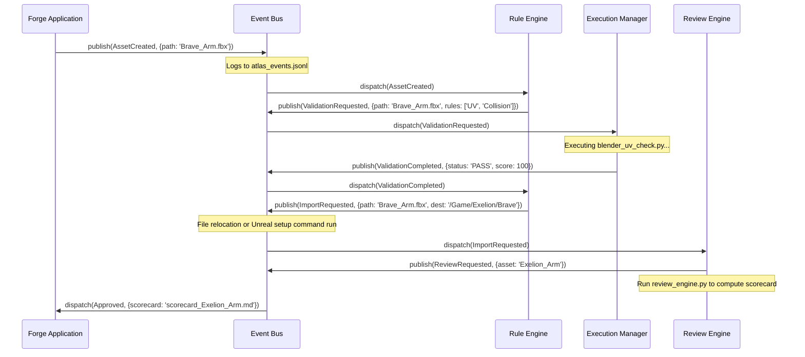
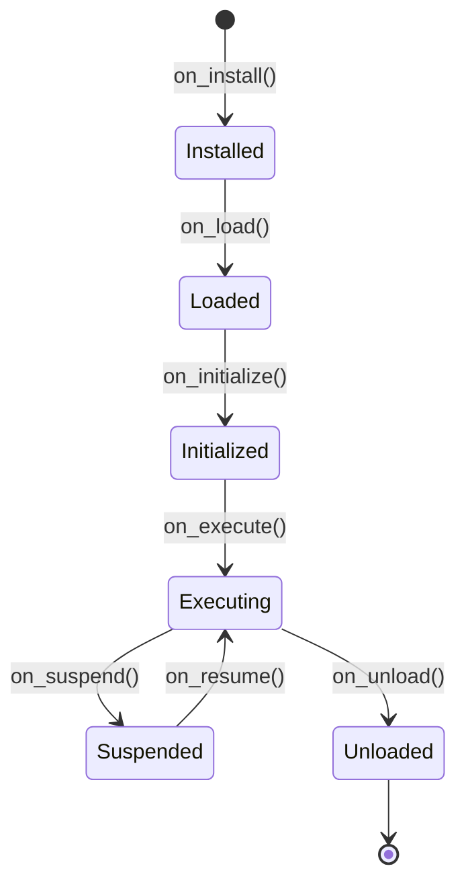
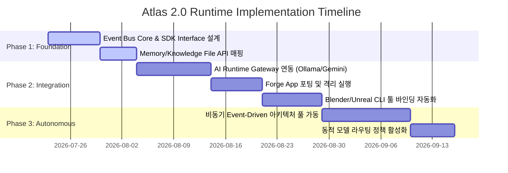

# Atlas 2.0 Runtime Architecture Specification

본 문서는 Atlas 1.2 RC의 핵심 아키텍처 철학(Registry ➔ Resolver ➔ Context ➔ Decision ➔ Execution)을 계층적으로 계승하며, AI 중심 개발 운영체제(DevOS)로 전환하기 위한 **Atlas 2.0 런타임 규격**을 정의합니다.

---

## 1. 현재 구조 분석 및 격차 (Current Analysis & Gaps)

```text
+---------------------------------------------------------------------------------+
|                                 [Layer 4: CLI]                                  |
+---------------------------------------------------------------------------------+
|                               [Layer 3: Execution]                              |
|   - tools/atlas_runner.py (Start/Finish CLI 루프 제어)                          |
+---------------------------------------------------------------------------------+
|                               [Layer 2: Decision]                               |
|   - priority_engine.py (정적 Bottleneck 점수 & 가중치 수식 스케줄러)            |
|   - rule_engine.py / review_engine.py (정적 CLI 툴 검증 및 Scorecard 작성)      |
+---------------------------------------------------------------------------------+
|                           [Layer 0-1: Domain & Resolvers]                       |
|   - ENVIRONMENTS.md, GOAL_REGISTRY.json, ATLAS_STATE.json (문서 기반 동기화)   |
+---------------------------------------------------------------------------------+
```

### 1.1 현재 구현 완료 영역 (v1.2 RC)
* **환경 및 상태 레지스트리**: [ENVIRONMENTS.md](file:///mnt/d/Atlas/ENVIRONMENTS.md), [GOAL_REGISTRY.json](file:///mnt/d/Atlas/GOAL_REGISTRY.json)을 파싱하여 호스트 제약 및 우선순위 대상을 추적하는 정적 리졸버 계층.
* **가중치 기반 태스크 스케줄링**: 공정 병목 테이블([bottleneck_analysis.md](file:///mnt/d/Atlas/core/workflow/bottleneck_analysis.md))을 읽어 우선순위 스코어를 산출하고 작업 목록을 정렬 및 마크다운에 쓰는 Priority Engine.
* **파일 기반 이벤트 로그**: `atlas_events.jsonl`에 단순 순차 로깅을 수행하는 영속성 계층.
* **에셋 정적 검증 파이프라인**: Blender 및 Unreal의 Mock 스크립트 실행과 텍스트 기반 Scorecard 검토 엔진.

### 1.2 Skeleton 및 설계 영역 (Gaps)
* **AI Runtime**: AI 인퍼런스 상태 머신(SERA)이 비어 있으며, 에이전트들의 프롬프트 인젝션 및 AI API 통합 게이트웨이가 없습니다.
* **비동기 Event Bus**: 이벤트 발행/구독(Pub-Sub) 및 프로세스 간 비동기 트리거 구조 없이, CLI 호출 시점에 동기식으로 일괄 처리합니다.
* **Plugin Host & SDK API**: Forge 등의 응용 프로그램을 OS 커널과 격리하는 앱 수명주기(Lifecycle) 및 커널 기능 접근용 SDK API 규격이 부재합니다.

---

## 2. Atlas Runtime 설계 (Runtime Architecture)

Atlas 2.0 커널은 상태 비저장(Stateless) 아키텍처에서 **메모리 지속형 비동기 서비스 실행기**로 진화합니다.

```text
       +--------------------------------------------------------------------+
       |                         Atlas 2.0 Kernel                           |
       |                                                                    |
       |   +-------------------+  +------------------+  +---------------+   |
       |   |  Session Manager  |  |    AI Runtime    |  |   Event Bus   |   |
       |   +-------------------+  +------------------+  +---------------+   |
       |   +-------------------+  +------------------+  +---------------+   |
       |   | Workflow Runtime  |  |  Memory Manager  |  | Knowledge Mgr |   |
       |   +-------------------+  +------------------+  +---------------+   |
       |   +-------------------+  +------------------+  +---------------+   |
       |   |    Plugin Host    |  |  Execution Mgr   |  |  Review Mgr   |   |
       |   +-------------------+  +------------------+  +---------------+   |
       +---------------------------------+----------------------------------+
                                         |
                                         v
       +--------------------------------------------------------------------+
       |                   Plugin Applications (Sandbox)                    |
       |                                                                    |
       |      +-----------------+                  +-----------------+      |
       |      |    Forge App    |                  |  Other App ...  |      |
       |      +-----------------+                  +-----------------+      |
       +--------------------------------------------------------------------+
```

### 2.1 구성요소별 책임 및 인터페이스 명세

#### A. Session Manager
* **책임**: 사용자 기기, 활성 프로젝트, 세션 타임아웃, 가용 시간 예산(Time Budget)을 동적으로 모니터링하고 세션 상태 변화를 커널에 동기화합니다.
* **인터페이스 (Python)**:
  ```python
  class SessionManager:
      def start_session(self, environment_id: str, project_name: str) -> str: ...
      def get_active_session(self) -> dict: ...
      def update_resource_budget(self, minutes_spent: int) -> None: ...
      def end_session(self) -> None: ...
  ```

#### B. AI Runtime
* **책임**: 로컬 LLM 및 클라우드 AI 연결 관리를 총괄하며, 프롬프트 템플릿에 `RuntimeContext` 정보를 주입(Context Injection)하고, 구조화된 응답을 파싱 및 유효성 검증을 거쳐 수합합니다.
* **인터페이스 (Python)**:
  ```python
  class AIRuntime:
      def execute_reasoning(self, agent_name: str, task_description: str, schema: dict) -> dict: ...
      def route_model(self, constraints: list, task_complexity: str) -> str: ...
  ```

#### C. Event Bus
* **책임**: 커널 내부 및 등록된 Plugin App 간에 이벤트를 전달하는 발행/구독(Pub-Sub) 미들웨어입니다. 모든 이벤트 발생 이력을 `atlas_events.jsonl`에 동시 영속화합니다.
* **인터페이스 (Python)**:
  ```python
  class EventBus:
      def publish(self, event_type: str, payload: dict) -> None: ...
      def subscribe(self, event_type: str, callback: Callable[[dict], None]) -> str: ...
      def unsubscribe(self, subscription_id: str) -> None: ...
  ```

#### D. Workflow Runtime
* **책임**: `priority_engine`이 추천한 태스크 목록을 기반으로 실제 에이전트/인간의 작업 실행 흐름 및 태스크 의존성을 실시간 오케스트레이션합니다.
* **인터페이스 (Python)**:
  ```python
  class WorkflowRuntime:
      def transition_task(self, task_id: str, new_status: str) -> None: ...
      def evaluate_dependencies(self, task_id: str) -> bool: ...
      def get_runnable_tasks(self) -> list: ...
  ```

#### E. Memory Manager
* **책임**: 세션 단위의 휘발성 단기 메모리(Session Context Buffer)와 파일 기반 ADR 의사결정 이력([memory.md](file:///mnt/d/Atlas/projects/excelion/memory.md)) 및 상태 히스토리를 질의하고 갱신합니다.
* **인터페이스 (Python)**:
  ```python
  class MemoryManager:
      def write_adr(self, adr_id: str, content: dict) -> None: ...
      def read_adr(self, adr_id: str) -> dict: ...
      def append_session_memory(self, key: str, value: Any) -> None: ...
      def get_session_memory(self, key: str) -> Any: ...
  ```

#### F. Knowledge Manager
* **책임**: [knowledge_base.md](file:///mnt/d/Atlas/core/rules/knowledge_base.md) 파일에 규정된 작업 원칙과 설계 이유를 기계 가독 포맷으로 파싱하여, 특정 작업 컨텍스트에 필수적인 지식 및 제약사항을 실시간으로 반환합니다.
* **인터페이스 (Python)**:
  ```python
  class KnowledgeManager:
      def get_rules_for_stage(self, target_stage: str) -> list: ...
      def search_best_practices(self, query: str) -> list: ...
  ```

#### G. Plugin Host
* **책임**: Forge와 같은 도메인 특화 애플리케이션의 설치, 메모리 격리 로드, 실행 제어 및 자원 제한(Sandboxing)을 관리합니다.
* **인터페이스 (Python)**:
  ```python
  class PluginHost:
      def load_application(self, app_path: str) -> str: ...
      def unload_application(self, app_id: str) -> None: ...
      def get_application_status(self, app_id: str) -> str: ...
  ```

#### H. Execution Manager
* **책임**: 룰 검증을 위한 Blender, Unreal Engine 등 서브프로세스 셸 환경 실행을 통제하며, 대상 기기 사양에 따라 모듈 부재 시 Simulation Pass 가상 실행 모드를 통합 조율합니다.
* **인터페이스 (Python)**:
  ```python
  class ExecutionManager:
      def run_validation(self, script_name: str, args: list) -> dict: ...
      def setup_simulation_env(self, target_tool: str) -> None: ...
  ```

#### I. Review Manager
* **책임**: 에셋 생성이나 코드 작성 결과로 발생한 각종 검사 데이터를 기반으로 품질 평가를 수합하고 Scorecard([scorecard_Exelion_Arm.md](file:///mnt/d/Atlas/core/review/scorecard_Exelion_Arm.md))를 자동 발행합니다.
* **인터페이스 (Python)**:
  ```python
  class ReviewManager:
      def compile_scores(self, audit_logs: list) -> dict: ...
      def generate_scorecard_file(self, asset_name: str, category_scores: dict) -> str: ...
  ```

---

## 3. AI Runtime (SERA 실행 환경)

AI Runtime은 개별 에이전트가 직접 상위 LLM API를 호출하는 방식이 아닌, **Atlas OS 커널이 제공하는 정형화된 추론 서비스 게이트웨이**로 통일됩니다.

```text
+-------------------+      API Request      +--------------------+      Request      +-------------+
|    Forge App      | --------------------> | Atlas AI Runtime   | ------------------> | Local LLM   |
| (No direct AI call| <-------------------- | (Context Injection,| <------------------ | (Ollama/vLLM|
+-------------------+      Structured       |  Model Routing,    |                     +-------------+
                             JSON           |  Schema Validation)|                     | Cloud AI    |
                                            +--------------------+                     | (Gemini API)|
                                                                                       +-------------+
```

### 3.1 LLM 연동 및 추론 프로토콜
* **Local LLM 인터페이스**: 호스트 GPU 가용 시 Ollama/vLLM 로컬 서버의 엔드포인트(`/api/generate`)를 통하며, 기본적으로 가벼운 구조 검증이나 Naming Rule 체크 등 저지연 연산에 사용됩니다.
* **Cloud AI 인터페이스**: 높은 추론 수준을 요하는 설계 변경, 코드 생성, 종합 Scorecard 코멘트 작성에는 Cloud API(Gemini 1.5 Pro/Flash 등)를 라우팅하여 활용합니다.

### 3.2 Model Selection & Routing 정책
* **Constraint Mapping**:
  * `no_gpu` 컨스트레인트 활성화 시 ➔ 무조건 Cloud API로 포워딩합니다.
  * `no_unreal` 컨스트레인트 활성화 시 ➔ Unreal 관련 태스크 시뮬레이션 용도로 로컬 LLM을 우선 배정합니다.
* **라우팅 매트릭스**:
  * *단순 텍스트 매칭/스타일 검증*: Local LLM (Llama 3.1 8B급)
  * *리깅/디포메이션 의사결정 및 ADR 결정 도출*: Cloud LLM (Gemini 1.5 Pro)

### 3.3 Agent Execution & Context Injection
1. **Context 수집**: `ContextResolver`가 현재 환경(DEV_WORK/DEV_HOME), 활성 스프린트, 리소스 한도 정보를 취합합니다.
2. **프롬프트 인젝션**: 커널은 에이전트 프롬프트 템플릿에 아래와 같은 구조화된 XML 형태로 실시간 상태를 강제 인젝션합니다.
   ```xml
   <atlas_runtime_context>
     <environment>DEV_WORK</environment>
     <constraints>no_unreal</constraints>
     <active_goal>EX-GOAL-001</active_goal>
   </atlas_runtime_context>
   ```
3. **스키마 검증 및 파싱**: LLM 출력은 Pydantic JSON 스키마를 강제(`response_format={"type": "json_object"}`)하여 받아내며, 커널 단에서 스키마 미 준수 시 재시도(Retry) 루틴을 수행한 후, 애플리케이션에 순수 정형 데이터만 돌려줍니다.

---

## 4. Event Architecture

JSONL 기반의 영속적 이벤트 로그 저장 형식을 유지하며, 런타임 상에서 동작할 실시간 비동기 **Event Bus**를 도입합니다.

### 4.1 핵심 이벤트 정의
* `AssetCreated`: Blender 또는 DCC 툴을 통해 원본 에셋(FBX, BLEND)이 지정 폴더에 생성될 때 발행됩니다.
* `ValidationRequested`: 특정 에셋의 정적/위상적 룰 검사가 필요한 시점에 Rule Engine을 향해 발행됩니다.
* `ValidationCompleted`: UV, 콜리전, 명명 규칙 검사가 종료되었을 때(성공/실패 페이로드 포함) 발행됩니다.
* `ImportRequested`: 검증 완료된 에셋을 Unreal Engine 등 대상 플랫폼에 임포트하려 할 때 발행됩니다.
* `ReviewRequested`: 임포트 완료 에셋의 종합 품질 점수 채점을 위해 Review Engine을 향해 발행됩니다.
* `Approved`: Review Score가 승인 한계선 이상으로 집계되어 태스크를 클로즈할 수 있을 때 발행됩니다.

### 4.2 에셋 제작 파이프라인 이벤트 플로우 시나리오



### 4.3 Event Schema 예시 (`ValidationCompleted`)
```json
{
  "event_id": "evt_8f3a9b1c-d72b-4c0e",
  "event_type": "ValidationCompleted",
  "timestamp": "2026-07-22T22:30:15Z",
  "session_id": "sess_01hk7a892b",
  "payload": {
    "target_asset": "Brave_Arm.fbx",
    "validator": "blender_uv_check",
    "status": "PASS",
    "details": {
      "overlapping_uv_islands": 0,
      "texel_density": "clean",
      "mesh_manifold": true
    },
    "score": 100
  }
}
```

---

## 5. Plugin Host & Application Lifecycle

Forge는 더 이상 Atlas 커널과 동등한 레벨의 스크립트가 아닙니다. **Atlas 커널에 탑재되는 샌드박스형 Plugin Application**으로 재정의됩니다.

### 5.1 Forge App의 격리 구조
* 커널이 구동될 때, `PluginHost`는 구성설정에 따라 Forge 디렉터리(`projects/excelion/` 등) 내 정의된 App 모듈을 로드합니다.
* Forge App은 직접 운영체제 자원이나 네트워크에 직접 접근하지 않고, 전달받은 `Kernel SDK API` 객체를 통해 파일 입출력 및 AI 모델 호출을 커널에 위임합니다.

### 5.2 Application Life Cycle 정의



* `on_install`: 앱에 필요한 디렉터리 구조 검사 및 종속성 라이브러리 유효성 체크.
* `on_load`: 메모리 공간에 앱 클래스 인스턴스 적재 및 이벤트 구독 리스너 바인딩.
* `on_initialize`: SDK 커널 포인터를 받아오고, `ATLAS_STATE` 기반 세션 상태와 로컬 리소스를 매핑.
* `on_execute`: 주력 비즈니스 태스크 루틴 실행 시작.
* `on_suspend`: 사용자 인터럽트 발생 또는 세션 가용 시간 만료 시 상태 저장 및 대기.
* `on_resume`: 대기 상태 해제 시 작업 컨텍스트 복구 및 실행 재개.
* `on_unload`: 리소스 핸들 반환, 이벤트 구독 해제 및 메모리 해제.

### 5.3 향후 확장 앱 수용 방안
동일한 App Lifecycle 명세를 상속받아, 게임 데이터 제작에 필요한 신규 전용 툴들을 플러그인 형태로 추가 가능하게 설계합니다.
* **Mission Editor App**: 미션 배치도 정합성 검사 및 밸런싱 추론 앱.
* **Dialogue Editor App**: 대사 번역 규칙성 확인 및 성우 스크립트 정합성 체크 앱.
* **Audio Studio App**: 사운드 웨이브 포맷 및 볼륨 세팅 검증 앱.
* **Test Center App**: Unreal 빌드 자동 배포 및 자동화 테스트 런너 앱.

---

## 6. Runtime API (Kernel SDK)

애플리케이션이 Atlas OS 커널 서비스에 안전하게 접근할 수 있도록 정의된 Python SDK 인터페이스입니다. 애플리케이션 실행 시 컨텍스트 주입 인자로 제공됩니다.

### 6.1 SDK API 주요 구성

#### A. Memory API
* `sdk.memory.get_adr(adr_id: str) -> dict`
* `sdk.memory.create_adr(adr_id: str, title: str, context: str, decision: str) -> bool`
* `sdk.memory.set_session_state(key: str, val: Any) -> None`

#### B. Knowledge API
* `sdk.knowledge.query_best_practice(target_stage: str) -> list[str]`
* `sdk.knowledge.validate_naming_rule(asset_name: str, asset_type: str) -> bool`

#### C. Workflow API
* `sdk.workflow.get_recommended_task() -> dict`
* `sdk.workflow.mark_task_status(task_id: str, status: str) -> bool`
* `sdk.workflow.check_dependencies(task_id: str) -> bool`

#### D. Event API
* `sdk.event.emit(event_type: str, payload: dict) -> None`
* `sdk.event.register_handler(event_type: str, handler: Callable) -> str`

#### E. AI API
* `sdk.ai.request_reasoning(prompt: str, json_schema: dict, use_gpu: bool = False) -> dict`
* `sdk.ai.get_agent_opinion(agent_name: str, context_payload: dict) -> str`

#### F. Resource API
* `sdk.resource.get_environment_info() -> dict`
* `sdk.resource.get_remaining_budget() -> int` # 남은 시간(분) 반환

#### G. Review API
* `sdk.review.submit_artifact_for_audit(filepath: str, stage: str) -> dict`
* `sdk.review.get_latest_scorecard(asset_name: str) -> dict`

---

## 7. 구현 로드맵 (Phased Roadmap)



### Phase 1: Foundation (v1.5)
* **목적**: 커널 코어 뼈대 형성 및 SDK 인터페이스 고정.
* **산출물**: 
  * 인메모리 Event Bus(`EventBus`)와 파일 영속 로그 연계 구현.
  * 커널 SDK API 껍데기(Mock 리턴 구조) 구현 및 `tools/atlas_runner.py`와의 구조적 결합.
  * `knowledge_base.md` 파서 모듈 개발.

### Phase 2: Integration & Local AI (v1.8)
* **목적**: 실제 AI 인프라와 플러그인 격리 모듈 탑재.
* **산출물**:
  * Ollama 로컬 LLM 통신 어댑터 및 Gemini Cloud API 게이트웨이 통합.
  * Forge를 독립 `AtlasApp`으로 분리 포팅하고 SDK API를 호출하여 작동하게 구조 이관.
  * `ExecutionManager`를 통해 Blender/Unreal의 배치 커맨드라인 에러 가로채기 및 자동 재시도 로직 활성화.

### Phase 3: Autonomous DevOS (v2.0)
* **목적**: 완전 비동기 반응형 AI 런타임 운영체제 달성.
* **산출물**:
  * 디렉터리 와처(Watcher) 서비스와 연동한 파일 생성 감지 시 `AssetCreated` 이벤트 자동 발생 파이프라인.
  * GPU 자원 및 난이도 기반 동적 모델 라우팅 실행.
  * 다중 애플리케이션(Mission Editor, Dialogue Editor 등) 동시 상주 상태 격리 관리 시스템 활성화.
