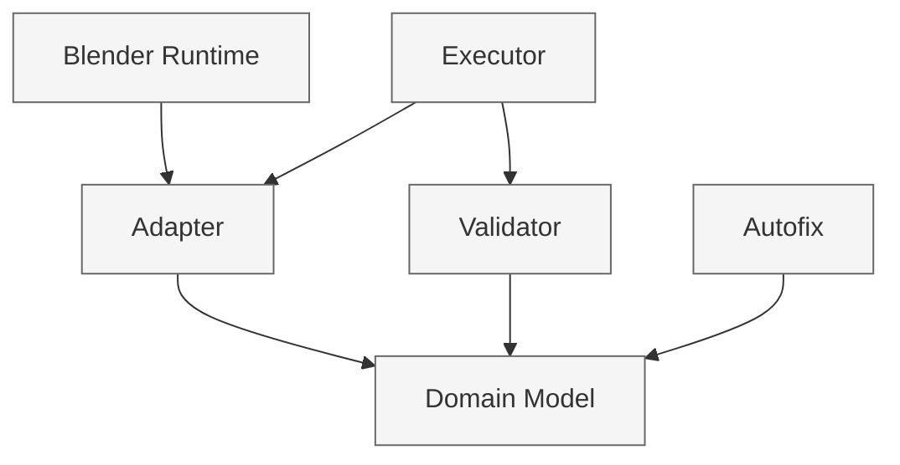

# Core Rules Architecture

## Overview

The core validation engine is now structured around a Blender-free domain model.

## Stable Architecture

### 1. Domain layer
- `ArmatureModel` is the canonical validation input.
- `BoneModel` is the canonical bone representation.
- Domain objects are immutable and carry invariants.

### 2. Adapter layer
- `BlenderArmatureAdapter` converts Blender armature objects into `ArmatureModel`.
- This is the only boundary where Blender-specific data is interpreted.

### 3. Validation layer
- Validators operate on `ArmatureModel` only.
- They implement business rules and emit `ValidationIssue` objects.

### 4. Autofix layer
- Autofix performs domain-level reconstruction rather than mutating Blender objects directly.
- This keeps fix logic aligned with the immutable domain model.

### 5. Execution layer
- The executor orchestrates validation and autofix by converting runtime input into the domain model first.

## Current Flow

1. Blender object enters through the adapter layer.
2. `BlenderArmatureAdapter` converts it into `ArmatureModel`.
3. Validators operate on `ArmatureModel` only.
4. Autofix rebuilds or rewrites the model rather than mutating raw Blender objects.
5. Execution is orchestrated through the executor layer.

## Boundary Rules

- Blender-specific logic belongs in adapter code only.
- Core rules must not depend on `bpy` directly.
- Domain logic must not depend on runtime object mutation semantics.

## Dependency Graph

The allowed direction is:

### Enforcement notes
- The diagram above is the canonical dependency view.
- Any new dependency that crosses a forbidden edge should be treated as an architecture violation.
- The regression tests in `tests/test_architecture_policy.py` enforce the documented boundary expectations.

### Allowed edges
- Adapter -> Domain
- Executor -> Adapter
- Executor -> Validator
- Validator -> Domain
- Autofix -> Domain

### Forbidden edges
- Validator -> Blender runtime
- Autofix -> Blender runtime
- Domain -> Blender runtime
- Domain -> Executor
- Validator -> Executor

## Governance Rules

### 1. Rule of ownership
- Adapter owns Blender boundary conversion.
- Domain owns invariants and structure.
- Validator owns rule evaluation.
- Executor owns orchestration.

### 2. Rule of dependency
- A layer may depend only on layers below it in the graph.
- No layer may reach directly into Blender runtime unless it is the adapter layer.

### 3. Rule of compatibility
- Compatibility helpers such as `common.py` and `api.py` dual-support are allowed only as stabilization layers.
- They must not become permanent architectural entry points.

### 4. Rule of cleanup
- Cleanup is allowed only when the replacement path is already covered by tests.
- Removal must be done in a backward-compatible step if external callers may still rely on it.

## Legacy Compatibility Policy

The following are treated as compatibility cushions and are not part of the core contract:
- `common.py` helper utilities
- `api.py` dual-support compatibility paths

These may remain in place for stability, but they are not required for the core architecture to function.

## Enforcement and Automation Roadmap

The structure is now stable enough to be treated as a policy surface.

1. Visualization
   - Keep the Mermaid dependency view in this document as the canonical architecture map.

2. Automated enforcement
   - Add CI checks that fail when forbidden imports or forbidden dependency edges appear.
   - Extend the regression suite with architecture-policy tests when a new boundary is introduced.
   - Regenerate the dependency graph with `python scripts/generate_dependency_graph.py` and review the output in CI.

3. Freeze policy
   - Treat this document as the architecture contract for the current implementation.
   - Any intentional change must be documented as an architectural change, not a silent refactor.

## Future Cleanup Roadmap

Cleanup work is optional and should be done only when there is a clear maintenance benefit.

1. `common.py` cleanup
   - Remove only after object-rule helpers are either inlined or moved to a dedicated utility layer.
   - Require regression tests to pass before and after the removal.

2. `api.py` cleanup
   - Remove dual-support only after all callers fully use the domain-model contract.
   - Require a migration gate before removal.

3. Documentation freeze
   - Keep this architecture document as the canonical description of the stable structure.
   - Update it only when the architecture intentionally changes.
